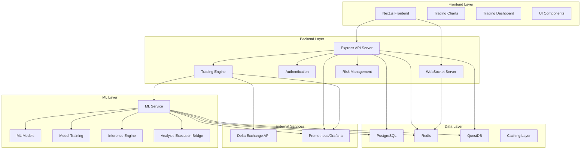
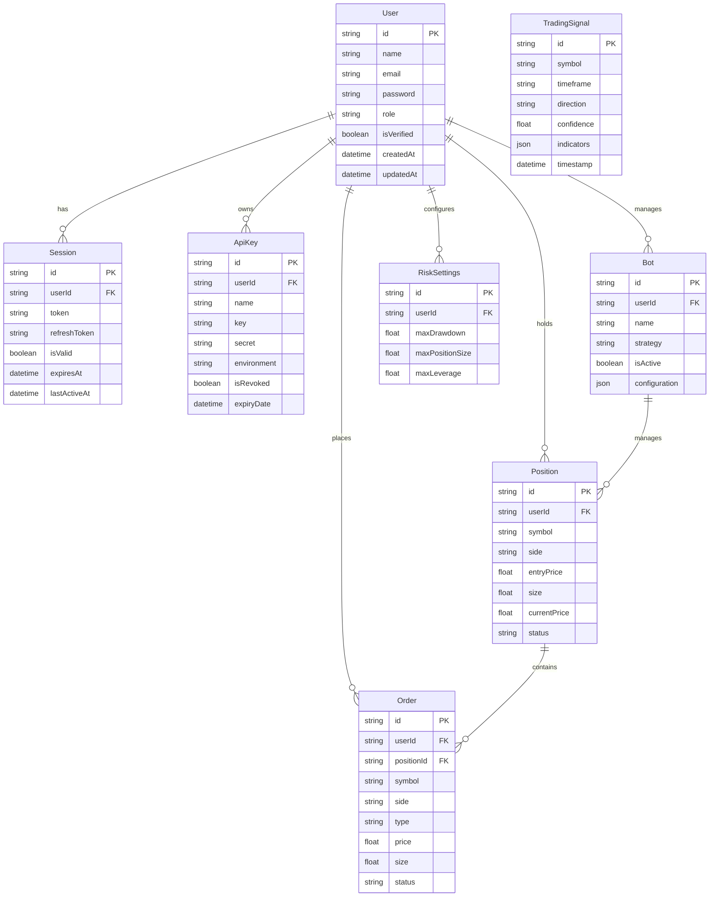

# SmartMarketOOPS Architecture

## Overview

SmartMarketOOPS is a sophisticated ML-driven trading system that functions as both a personal trading dashboard for Delta Exchange and a portfolio showcase. The platform integrates advanced machine learning algorithms with real-time market data to identify and execute trades based on Smart Money Order Block patterns.

This document outlines the architecture of the SmartMarketOOPS trading platform, including its components, interactions, and design patterns.

## System Architecture

The system follows a microservices architecture with three main components:



### Frontend Layer

The frontend is built with Next.js 15 and React 19, providing a professional trading dashboard with real-time charts, portfolio management, and trade execution capabilities.

Key components:
- **Trading Dashboard**: Main interface for users to view market data and execute trades
- **Portfolio Display**: Shows current positions, balances, and performance metrics
- **Trade Execution Panel**: Interface for placing and managing trades
- **Charts**: Real-time price charts with technical indicators

### Backend Layer

The backend is built with Express.js and TypeScript, handling API requests, WebSocket communication, authentication, trading logic, and integration with Delta Exchange.

Key components:
- **API Server**: RESTful API for data access and trading operations
- **WebSocket Server**: Real-time updates for market data and trading signals
- **Authentication**: User authentication and authorization
- **Trading Engine**: Core trading logic and order execution
- **Risk Management**: Position sizing, stop loss, and risk assessment

### ML Layer

The ML layer is built with Python, PyTorch, and FastAPI, providing trade signal generation, risk assessment, and market analysis.

Key components:
- **ML Service**: FastAPI service for ML model inference
- **Models**: LSTM, GRU, and Transformer models for price prediction
- **Training**: Model training and evaluation pipeline
- **Inference Engine**: Real-time inference for trading signals
- **Bridge**: Integration between ML predictions and trading execution

### Data Layer

The data layer consists of multiple databases for different purposes:

- **PostgreSQL**: Main database for user data, authentication, and trading history
- **Redis**: Caching and real-time data streaming
- **QuestDB**: Time-series database for market data and performance metrics

## Key Design Patterns

### Environment Configuration

The system uses a centralized environment configuration pattern to manage environment variables:

```typescript
// backend/src/config/environment.ts
export const PORT = parseInt(process.env.PORT || '3006', 10);
export const NODE_ENV = process.env.NODE_ENV || 'development';
```

This ensures consistent access to environment variables throughout the application.

### Error Handling

The system uses a centralized error handling pattern:

```typescript
// backend/src/utils/errorHandler.ts
export class ApiError extends Error {
  statusCode: number;
  isOperational: boolean;
  errorCode?: string;
  details?: any;

  constructor(
    message: string,
    statusCode: number = 500,
    isOperational: boolean = true,
    errorCode?: string,
    details?: any
  ) {
    super(message);
    this.statusCode = statusCode;
    this.isOperational = isOperational;
    this.errorCode = errorCode;
    this.details = details;
    
    Error.captureStackTrace(this, this.constructor);
  }
}
```

This provides consistent error responses across the API.

### Logging

The system uses a centralized logging pattern:

```typescript
// backend/src/utils/logger.ts
export function createLogger(moduleName: string): Logger {
  return new Logger(moduleName);
}
```

This ensures consistent logging format and level across the application.

### Service Pattern

The system uses the service pattern to encapsulate business logic:

```typescript
// backend/src/services/DeltaExchangeUnified.ts
export class DeltaExchangeUnified {
  constructor(credentials: DeltaCredentials) {
    this.credentials = credentials;
    // Initialize service
  }

  async getProducts(): Promise<Product[]> {
    // Implementation
  }

  async placeOrder(orderRequest: OrderRequest): Promise<Order> {
    // Implementation
  }
}
```

This provides a clean separation of concerns and improves testability.

## Database Schema

The system uses PostgreSQL with Prisma ORM, with key models including:



## API Structure

The API follows a RESTful design with the following main endpoints:

- `/api/auth`: Authentication endpoints
- `/api/users`: User management endpoints
- `/api/trading`: Trading endpoints
- `/api/market-data`: Market data endpoints
- `/api/ml`: Machine learning endpoints
- `/api/risk`: Risk management endpoints

## Deployment

The system is deployed using Docker Compose with separate containers for:

- Frontend
- Backend
- ML System
- PostgreSQL
- Redis
- QuestDB
- Prometheus/Grafana

## Monitoring and Logging

The system uses Prometheus and Grafana for monitoring, with custom metrics for:

- API response times
- Trading performance
- ML model accuracy
- System resource usage

Logging is centralized using Winston with different log levels for development and production.

## Security

The system implements several security measures:

- JWT-based authentication
- API key encryption
- Rate limiting
- Input validation
- Audit logging

## Performance Optimization

The system includes several performance optimizations:

- Redis caching for frequently accessed data
- Database query optimization
- Connection pooling
- Compression middleware
- Response time monitoring

## Conclusion

The SmartMarketOOPS architecture is designed to be scalable, maintainable, and secure. By following established design patterns and best practices, the system provides a robust foundation for ML-driven trading.