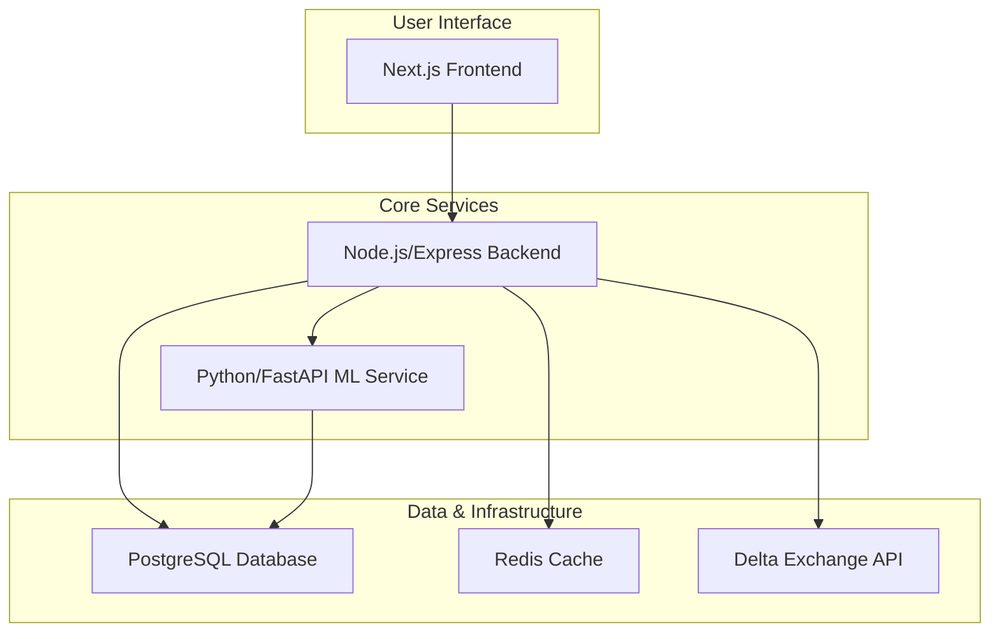

# SmartMarketOOPS Architecture

## Overview

SmartMarketOOPS is an advanced, AI-driven trading platform. It is designed as a multi-component system that works together to create a "human-like" trading agent that can learn and adapt over time.

The system's architecture is based on a separation of concerns, with three primary services: a frontend for user interaction, a backend for orchestration and communication, and a machine learning service for intelligence.

## System Architecture

The project follows a microservices-like pattern:

### Frontend Layer (`frontend/`)
The frontend is a modern web application built with **Next.js** and **TypeScript**. It provides the user with a dashboard to:
- Monitor real-time market data.
- View trading charts and performance metrics.
- Provide feedback on the agent's trades to guide its learning (RLHF).

### Backend Layer (`backend/`)
The backend is the central nervous system of the application, built with **Node.js**, **Express.js**, and **Prisma**. Its key responsibilities include:
- Serving the API for the frontend.
- Managing user authentication and API keys.
- Connecting to the **Delta Exchange API** to fetch market data and execute trades.
- Orchestrating the flow of information between the frontend and the ML service.
- Storing trade history, user data, and feedback in the **PostgreSQL** database.

### ML Layer (`ml/`)
The ML layer is a **Python** service that contains the core intelligence of the trading agent. It is responsible for:
- **Imitation Learning:** Training models to mimic expert trading behavior from logged data.
- **Reinforcement Learning (RL):** Fine-tuning models in a simulated trading environment.
- **Meta-Learning:** Adapting strategies to new market conditions.
- Serving the trained models via a **FastAPI** endpoint that the backend can query for trading signals.

### Data Layer (`data/`)
This directory contains all the data used and generated by the system, including:
- Raw historical market data.
- Expert trade logs for imitation learning.
- Human feedback data for RLHF.
- Saved model files.

## Development Workflow

The development workflow is designed around a phased approach to building the human-like trading agent:
1.  **Data Collection:** The system first collects expert trading data.
2.  **Imitation Learning:** A foundational model is trained on this data.
3.  **RL + RLHF:** The model is then fine-tuned using reinforcement learning and human feedback.
4.  **Meta-Learning:** The agent learns to adapt to new data.
5.  **Hybrid Deployment:** The final agent combines all these learned strategies with a set of core rules.

This iterative process is designed to create a robust and adaptive trading agent. For more details, see the [gemini-plan.md](../gemini-plan.md).
