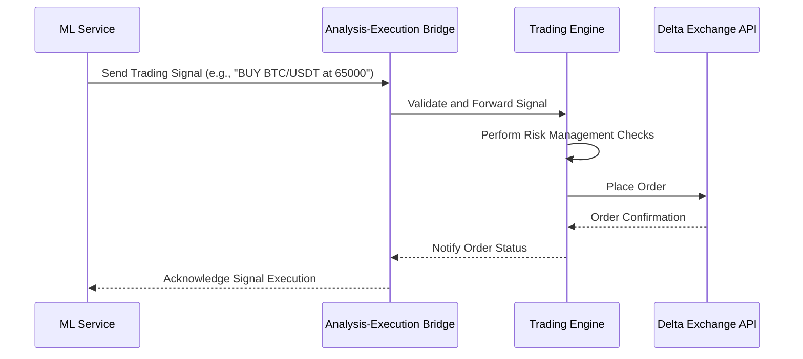

```mermaid
sequenceDiagram
    participant ML_Service as ML Service
    participant AnalysisExecutionBridge as Analysis-Execution Bridge
    participant TradingEngine as Trading Engine
    participant DeltaExchange as Delta Exchange API

    ML_Service->>AnalysisExecutionBridge: Send Trading Signal (e.g., "BUY BTC/USDT at 65000")
    AnalysisExecutionBridge->>TradingEngine: Validate and Forward Signal
    TradingEngine->>TradingEngine: Perform Risk Management Checks
    TradingEngine->>DeltaExchange: Place Order
    DeltaExchange-->>TradingEngine: Order Confirmation
    TradingEngine-->>AnalysisExecutionBridge: Notify Order Status
    AnalysisExecutionBridge-->>ML_Service: Acknowledge Signal Execution
```
