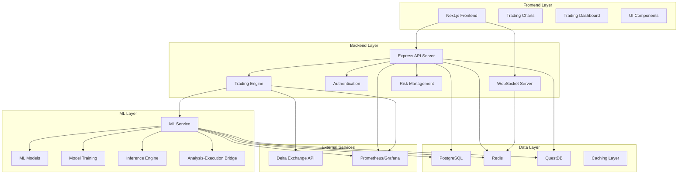
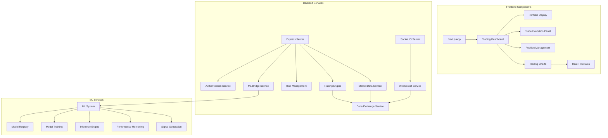
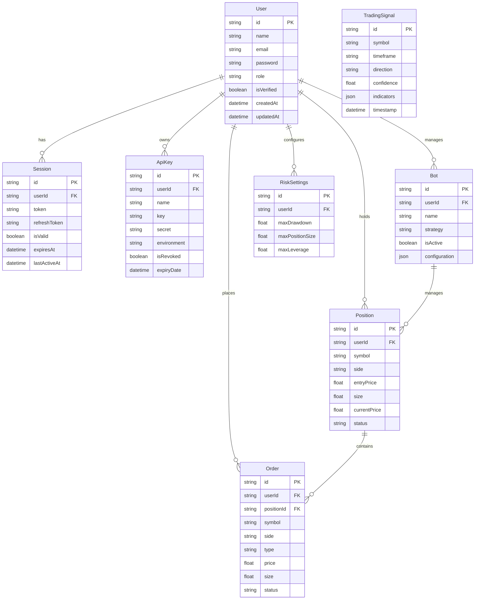
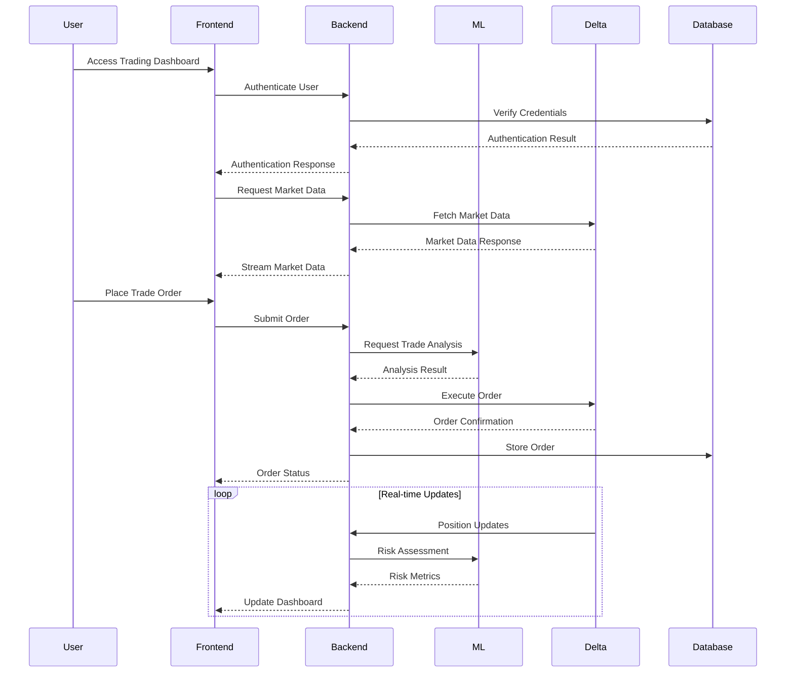
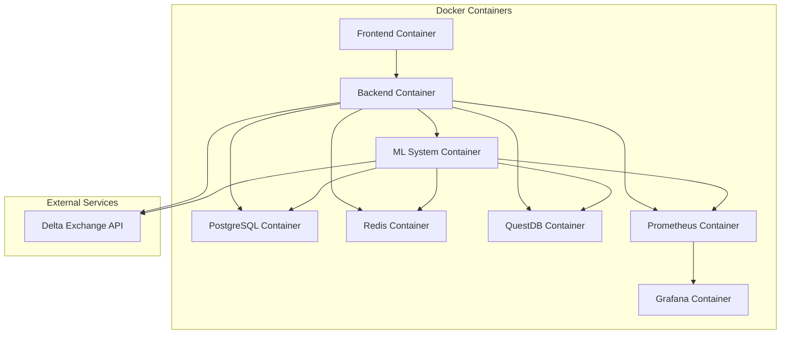

# SmartMarketOOPS System Architecture

## System Overview

```mermaid
graph TD
    subgraph "Frontend Layer"
        FE[Next.js Frontend]
        Charts[Trading Charts]
        Dashboard[Trading Dashboard]
        UI[UI Components]
    end

    subgraph "Backend Layer"
        API[Express API Server]
        WS[WebSocket Server]
        Auth[Authentication]
        Trading[Trading Engine]
        Risk[Risk Management]
    end

    subgraph "ML Layer"
        ML[ML Service]
        Models[ML Models]
        Training[Model Training]
        Inference[Inference Engine]
        Bridge[Analysis-Execution Bridge]
    end

    subgraph "Data Layer"
        Postgres[PostgreSQL]
        Redis[Redis]
        QuestDB[QuestDB]
        Cache[Caching Layer]
    end

    subgraph "External Services"
        Delta[Delta Exchange API]
        Monitoring[Prometheus/Grafana]
    end

    FE --> API
    FE --> WS
    API --> Trading
    API --> Auth
    API --> Risk
    Trading --> ML
    Trading --> Delta
    ML --> Models
    ML --> Training
    ML --> Inference
    ML --> Bridge
    API --> Postgres
    API --> Redis
    API --> QuestDB
    ML --> Postgres
    ML --> Redis
    ML --> QuestDB
    WS --> Redis
    API --> Monitoring
    ML --> Monitoring
    Trading --> Monitoring
```

## Component Architecture

```mermaid
graph TD
    subgraph "Frontend Components"
        NextApp[Next.js App]
        TradingDashboard[Trading Dashboard]
        PortfolioDisplay[Portfolio Display]
        TradeExecution[Trade Execution Panel]
        PositionManagement[Position Management]
        Charts[Trading Charts]
        RealTimeData[Real-Time Data]
    end

    subgraph "Backend Services"
        ExpressServer[Express Server]
        SocketIO[Socket.IO Server]
        AuthService[Authentication Service]
        TradingEngine[Trading Engine]
        RiskManagement[Risk Management]
        MarketDataService[Market Data Service]
        DeltaExchangeService[Delta Exchange Service]
        WebSocketService[WebSocket Service]
        MLBridge[ML Bridge Service]
    end

    subgraph "ML Services"
        MLSystem[ML System]
        ModelRegistry[Model Registry]
        ModelTraining[Model Training]
        InferenceEngine[Inference Engine]
        PerformanceMonitoring[Performance Monitoring]
        SignalGeneration[Signal Generation]
    end

    NextApp --> TradingDashboard
    TradingDashboard --> PortfolioDisplay
    TradingDashboard --> TradeExecution
    TradingDashboard --> PositionManagement
    TradingDashboard --> Charts
    Charts --> RealTimeData

    ExpressServer --> AuthService
    ExpressServer --> TradingEngine
    ExpressServer --> RiskManagement
    ExpressServer --> MarketDataService
    ExpressServer --> MLBridge
    SocketIO --> WebSocketService
    TradingEngine --> DeltaExchangeService
    MarketDataService --> DeltaExchangeService
    WebSocketService --> DeltaExchangeService
    MLBridge --> MLSystem

    MLSystem --> ModelRegistry
    MLSystem --> ModelTraining
    MLSystem --> InferenceEngine
    MLSystem --> PerformanceMonitoring
    MLSystem --> SignalGeneration
```

## Database Schema

```mermaid
erDiagram
    User {
        string id PK
        string name
        string email
        string password
        string role
        boolean isVerified
        datetime createdAt
        datetime updatedAt
    }
    
    Session {
        string id PK
        string userId FK
        string token
        string refreshToken
        boolean isValid
        datetime expiresAt
        datetime lastActiveAt
    }
    
    ApiKey {
        string id PK
        string userId FK
        string name
        string key
        string secret
        string environment
        boolean isRevoked
        datetime expiryDate
    }
    
    Bot {
        string id PK
        string userId FK
        string name
        string strategy
        boolean isActive
        json configuration
    }
    
    Position {
        string id PK
        string userId FK
        string symbol
        string side
        float entryPrice
        float size
        float currentPrice
        string status
    }
    
    Order {
        string id PK
        string userId FK
        string positionId FK
        string symbol
        string side
        string type
        float price
        float size
        string status
    }
    
    TradingSignal {
        string id PK
        string symbol
        string timeframe
        string direction
        float confidence
        json indicators
        datetime timestamp
    }
    
    RiskSettings {
        string id PK
        string userId FK
        float maxDrawdown
        float maxPositionSize
        float maxLeverage
    }

    User ||--o{ Session : has
    User ||--o{ ApiKey : owns
    User ||--o{ Bot : manages
    User ||--o{ Position : holds
    User ||--o{ Order : places
    User ||--o{ RiskSettings : configures
    Position ||--o{ Order : contains
    Bot ||--o{ Position : manages
```

## Data Flow

```mermaid
sequenceDiagram
    participant User
    participant Frontend
    participant Backend
    participant ML
    participant Delta
    participant Database
    
    User->>Frontend: Access Trading Dashboard
    Frontend->>Backend: Authenticate User
    Backend->>Database: Verify Credentials
    Database-->>Backend: Authentication Result
    Backend-->>Frontend: Authentication Response
    
    Frontend->>Backend: Request Market Data
    Backend->>Delta: Fetch Market Data
    Delta-->>Backend: Market Data Response
    Backend-->>Frontend: Stream Market Data
    
    User->>Frontend: Place Trade Order
    Frontend->>Backend: Submit Order
    Backend->>ML: Request Trade Analysis
    ML-->>Backend: Analysis Result
    Backend->>Delta: Execute Order
    Delta-->>Backend: Order Confirmation
    Backend->>Database: Store Order
    Backend-->>Frontend: Order Status
    
    loop Real-time Updates
        Delta->>Backend: Position Updates
        Backend->>ML: Risk Assessment
        ML-->>Backend: Risk Metrics
        Backend-->>Frontend: Update Dashboard
    end
```

## Deployment Architecture

```mermaid
graph TD
    subgraph "Docker Containers"
        Frontend[Frontend Container]
        Backend[Backend Container]
        ML[ML System Container]
        Postgres[PostgreSQL Container]
        Redis[Redis Container]
        QuestDB[QuestDB Container]
        Prometheus[Prometheus Container]
        Grafana[Grafana Container]
    end

    subgraph "External Services"
        DeltaExchange[Delta Exchange API]
    end

    Frontend --> Backend
    Backend --> ML
    Backend --> Postgres
    Backend --> Redis
    Backend --> QuestDB
    ML --> Postgres
    ML --> Redis
    ML --> QuestDB
    Backend --> DeltaExchange
    ML --> DeltaExchange
    
    Backend --> Prometheus
    ML --> Prometheus
    Prometheus --> Grafana
```